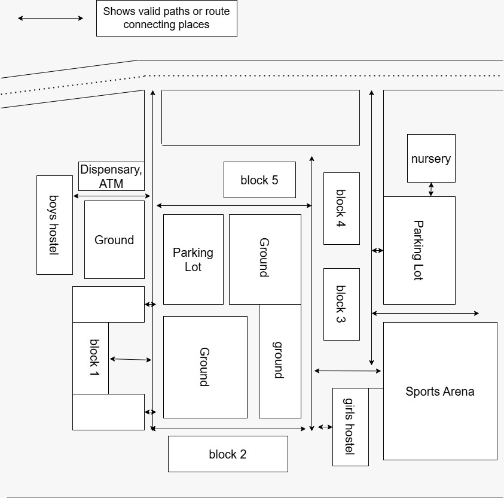
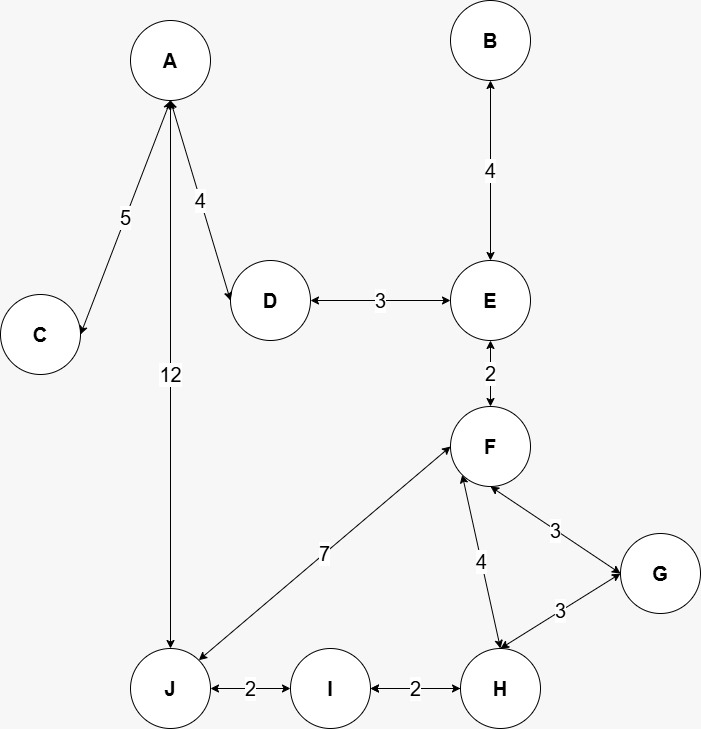
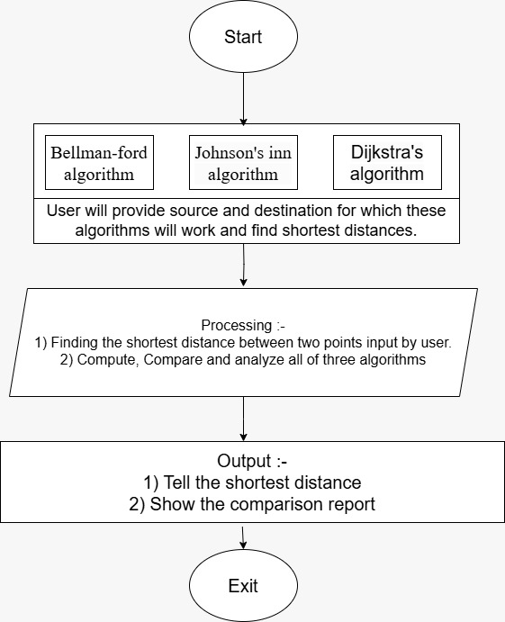

<h1 align="center">🧭 Campus Navigation System - Android Application</h1>

  An <b>Android-based campus navigation tool</b> that helps students, faculty, and visitors find the shortest path between blocks within the campus. 
  <b>Map used:</b> CGC Jhanjeri 
  The app uses <b>Dijkstra</b>, <b>Bellman-Ford</b>, and <b>Johnson’s</b> algorithms to simulate and visualize the most efficient routes.

<b>📍 Built with:</b> Android Studio (Kotlin) and Custom Graph Algorithms

---

<h2>🗺️ How It Works</h2>

Each building (A, B, C...) is treated as a <b>node</b>, and each path is an <b>edge</b> with weights based on real distances (in meters). 
Users can choose a source, destination, and algorithm to compute the optimal path between points.

<h2>📌 Features</h2>
<ul>
  <li>Visualized shortest paths on the campus map</li>
  <li>Selectable graph algorithms (Dijkstra, Bellman-Ford, Johnson)</li>
  <li>Animated graph traversal</li>
  <li>Displays total calculated path distance</li>
  <li>Clean, minimal and interactive UI</li>
</ul>

<h2>📚 Algorithms Used</h2>
<table>
  <tr>
    <th align="left">Algorithm</th>
    <th align="left">Highlights</th>
    <th align="left">Time Complexity</th>
  </tr>
  <tr>
    <td><b>Dijkstra</b></td>
    <td>Fastest for non-negative weights</td>
    <td>O((V + E) log V)</td>
  </tr>
  <tr>
    <td><b>Bellman-Ford</b></td>
    <td>Handles negative weights, simple to implement</td>
    <td>O(V × E)</td>
  </tr>
  <tr>
    <td><b>Johnson’s</b></td>
    <td>All-pairs shortest paths using Dijkstra & reweighting</td>
    <td>O(VE + V log V)</td>
  </tr>
</table>

<h2>📷 Visuals</h2>

<h4>🏫 College Map Layout</h4>

<h4>🔗 Graph Representation</h4>

<h4>📊 Algorithm Flow</h4>

---

<h2>ℹ️ Additional Info</h2>
<ul>
  <li>Coordinates placed to match the real CGC Jhanjeri campus layout</li>
  <li>Graph built manually to demonstrate algorithm traversal</li>
  <li>Dropdown UI to select source, destination, and algorithm</li>
  <li>Reset and re-calculate at any time</li>
  <li>Designed as an <b>Experiential Learning Project (March 2025)</b></li>
</ul>

---

<h2>📘 Educational Disclaimer</h2>

This project is strictly for educational purposes only. 
It was developed as part of a college-level academic project to understand how shortest path algorithms work in the real world using Android & graph-based visualization. 
This is <b>not intended</b> for use by general users or for production-level deployment.

<b>Please avoid using the app in dark mode — UI is best viewed in light mode only.</b>

If you face any issues, feel free to open an issue in this repository — but please note that <b>there is no guarantee of future updates</b>. This may be the final version.

---

<h2>🙌 Contributions Welcome</h2>

Anyone is free to contribute, explore the codebase, or improve upon this demo. 
This project is a simple demonstration of how shortest path algorithms can be implemented and visualized in a real-world-like Android application using graphs.

---

<h2>📦 Download</h2>

You can download the latest APK from the <a href="https://github.com/VaibhavRawat27/Campus-Navigation-System/releases/tag/V1.0">Releases</a> section.

---

<h2 align="center">🎉 Thanks for checking out the project!</h2>

This is a final submission and I may not maintain this code going forward.

